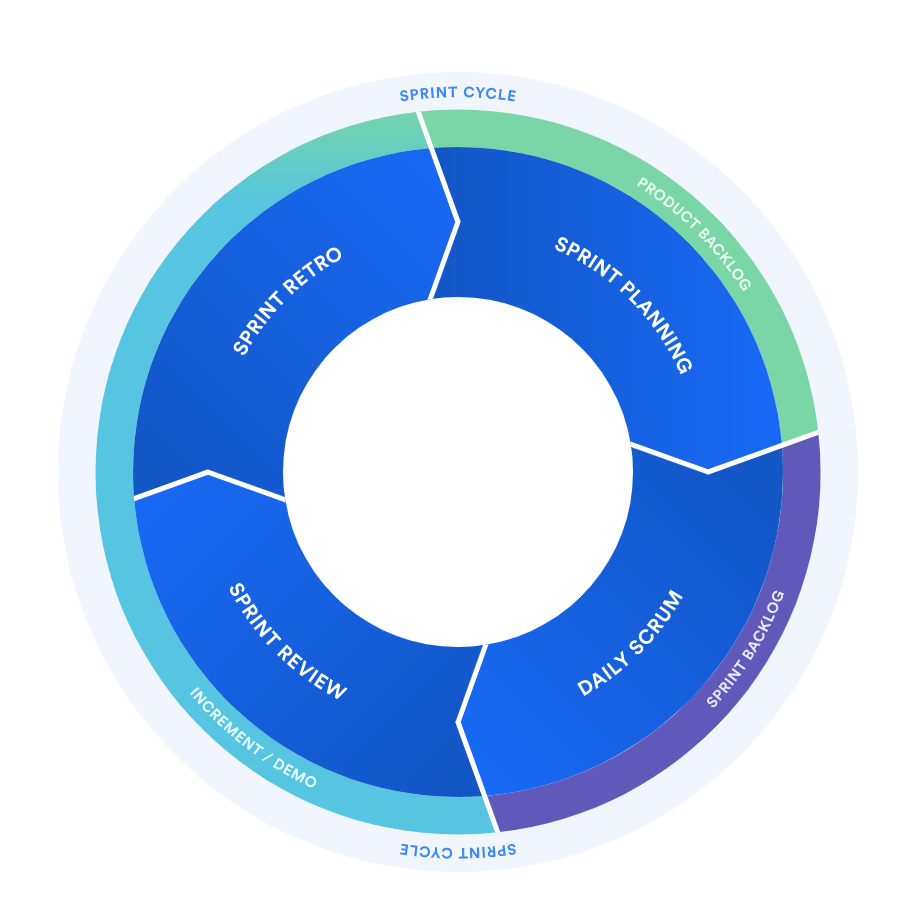
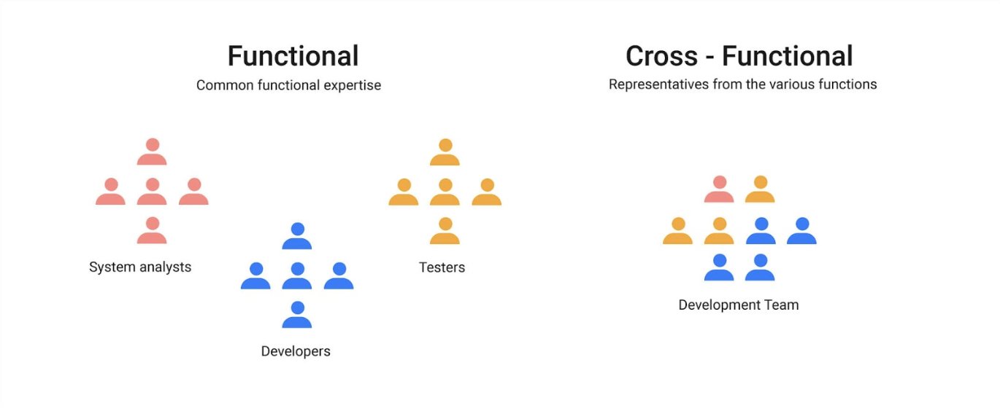
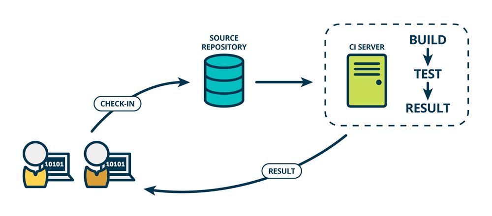
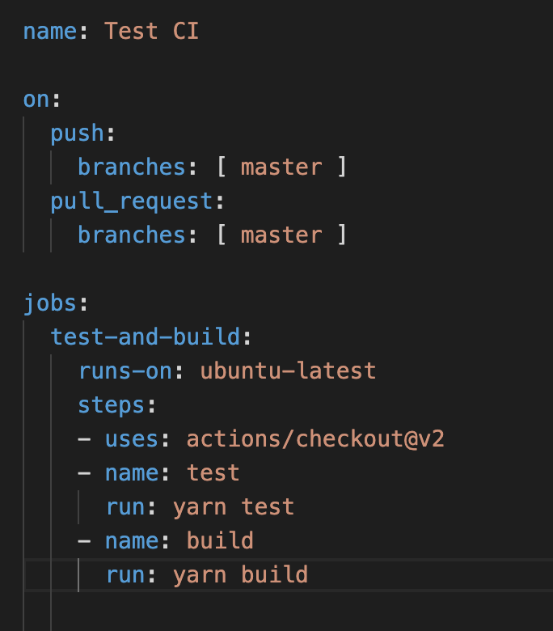
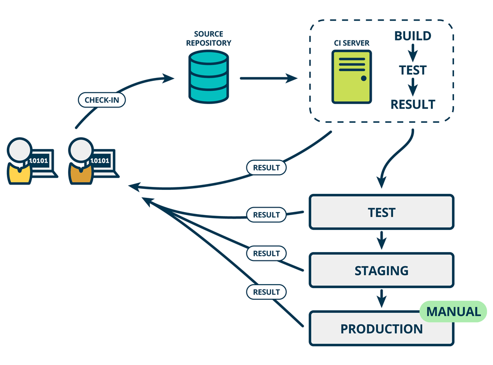
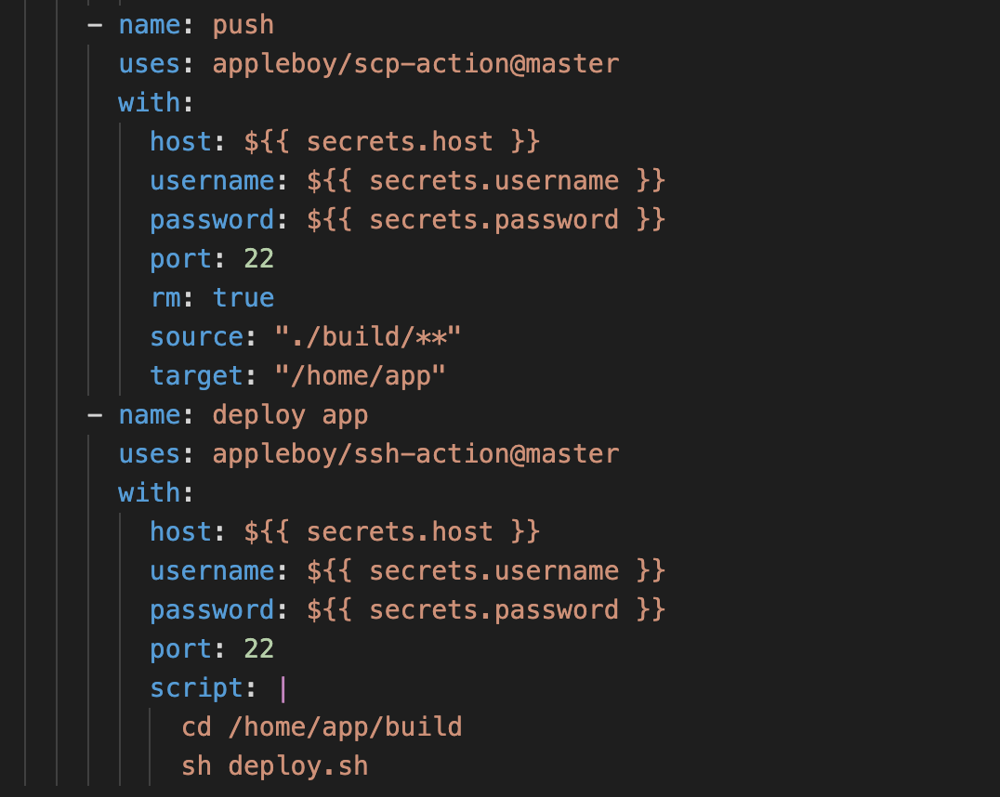

# 工程师眼里的敏捷活动
经历过各种不同类型的开发模式，觉得现在是时候停下来，从工程师的视角来聊一聊敏捷了。当我们去查找敏捷相关的资料的时候，很容易的会找到敏捷宣言：
> 个体和互动 高于 流程和工具
工作的软件 高于 详尽的文档
客户合作 高于 合同谈判
响应变化 高于 遵循计划
也就是说，尽管右项有其价值，
我们更重视左项的价值。

足够的简练，但是初初读下来，却没什么卵用。

在我看来，敏捷开发的目的是为了在一定时间内交付出具有用户价值的软件，并且这个过程是可持续的。为了这个目的，会进行一系列的活动，这些活动就是敏捷活动。为了组织这一系列的活动，有人便将一些方法固定了下来，于是有了一些我们熟悉的名词，比如 scrum， kanban 等等。但是国内的很多公司，却仅仅以【一定时间内交付出】作为软件开发的指导原则，却忽略了可持续和客户价值，毕竟这便满足了黑心老板的压榨员工的心愿，于是加班盛行。 笑:)

特别喜欢日本剑道里的一个理念：守，破，离。这也应该成为敏捷活动的一个理念。譬如如果一个团队使用scrum作为敏捷活动的框架，一开始去遵守它就好了，这便是【守】。当你很熟悉这套活动框架的时候，便根据实际情况去改进它，可能只是很细小的一个点，去试着把它变得更好，这便是【破】。最后，当你觉得这套框架已经不适合团队活动了，那就大胆的摒弃它吧，因为这就是最后一个：【离】。

## 敏捷框架 - SCRUM
既然要说敏捷，必然绕不开那一系列的敏捷活动框架。所谓活动框架，无非是一系列对开发活动的指导和约束，更具体一点就是在什么时间用什么方法做什么事。业界常用活动框架有scrum，kanban，XP 等等。笔者对scrum比较熟悉，所以便借scrum来对活动框架来进一步讲述。Scrum 鼓励团队的成员从经验中来学习，利用自组织的方式来解决问题，并且从结果中得到反馈并进行改进，但是它的目和敏捷的目的是一致的：在一定时间内交付出具有用户价值的软件，并且这个过程是可持续的。scrum 下的软件开发会被拆分成一个一个的sprint。 每一个sprint 都具有完整的周期，有固定的时长，有固定的人员，有固定的需求，在这个周期内需要交付出完整的具有客户价值的软件功能。所以sprint可以理解为我们日常开发的组成单位。每一个sprint 都会从上一个sprint中得到反馈并持续改进当前的软件开发流程，由此形成一个循环，直到整个软件周期的结束。从总体上来看，scrum 有两个部分会显得极其重要，一个是 sprint， 另一个便是执行sprint 的团队的角色构成(role)。

### sprint
一个sprint是一段时长固定的时期，通常是两周，在这段时间里，团队成员一起来完成一系列的工作，并交付出可运行软件功能。那一个sprint 又是如何执行的呢？如下图，其实它是一个 由`sprint planing`, `daily meeting`, `sprint review`, `sprint retro`组成的的循环。

- sprint planning
一个sprint起始于**sprint planning**。在这个阶段需要做两件事，
 1. 这次sprint需要完成什么， 比如我们需要用户能够进行登录。
 2. 我们该如何完成我们这个sprint的目标。 比如，为了用户能够进行登录，我们需要有一个登录页面，需要一个登录接口，需要设计并创建数据库表来保存登录信息，需要登录成功之后的跳转。当然这些都需要在进行**sprint planning** 之前放到 **product backlog**. 而**sprint planning**只是从**product backlog** 里挑选出高优先级的放到此次的**sprint backlog**。

- daily meeting
在 sprint planning之后，便可以着手进行处理放到sprint backlog中的事项。但是需要有一个机制，去检查每个事项的进度，了解出现了什么问题。所以在整个sprint的过程中，会需要daily meeting 来做这些同步，在这个会议上一般会搞清楚这三件事：1. 我昨天做了哪些事；2.我今天会做哪些事；3.我遇到了哪些阻碍我的问题。

- Sprint review

在完成了**sprint backlog** 里的工作之后，便可以将大家这段时间辛苦工作的成果展示出来并收集来自各方的反馈，这个过程便是**sprint review**。

- Sprint retro

**Sprint retro**是一个回顾性的会议，目的就是检查和调整。在这个阶段，需要对过去的这个sprint进行回顾，找出需要保持的地方和需要改进的地方。

以上四个步骤组成了scrum 的一个sprint。软件开发的活动依照着这四个步骤来进行，当然可以根据团队和产品的具体情况进行微调，但是大体上都是在这个框架范围内。

## 代表着责任的角色

Scrum 里定义了三种角色
- scrum master
- development team members
- product owner

这三个角色是对团队成员角色的定义，而非是*title*， 因为scrum是提倡的便是自组织，团队中的任何人觉得如果自己能承担这个责任，他都可以赋予自己这个责任所对应的角色。但是在通常在实际操作中，会有专门固定的人担任这些角色。

基本上，软件工程师都会在**development team members** 这个角色中，但是并不是意味着**development team**仅仅只是包含了软件工程师。和传统的团队构成不同，**development team members** 是一个跨职能的组成，这里可能包含了UX / UI designers, 测试工程师等等，他们能决定这个sprint需要交付哪些功能，他们需要紧密的合作保证功能能够交付，问题能够被修复。跨职能的团队构成由于不同背景的人在一起紧密的合作，有效的提升沟通效率，并且有利于创意想法的产生。

而**product owner**则需要保证产品的方向是清晰的，交付出去的产品或者功能是具有价值的， 他们需要确定哪些需求的优先级高，哪些是可以缓一缓。而**scrum master**则是需要保证整个scrum的流程能顺利运行起来，并引导其它角色的成员持续的对流程进行改进。

以上便是scrum的核心组成部分，通过定义sprint的流程来组织整个软件开发活动，通过定义三种不同的角色，来让sprint能够顺利的运行起来。但是一次又一次的sprint，一次又一次的交付新功能， 软件的规模也越来越大，需要顾及的东西越来越多，由于每个sprint的是时间是固定的，是不是意味着每次sprint能交付的功能越来越少？如果是，那怎么解决这个问题？答案就是自动化。

## 自动化

所谓自动化，就是将流程化的东西固化下来，利用计算机而非人去执行这些操作，在软件开发领域，通常会有很多工具来帮你做自动化，比如Jenkins，gitlab CI， github Action 等都是很好的自动化管理工具。这些工具能很好的帮助软件开发团队进行软件的持续集成和部署。

### 持续集成

当新一个软件模块开发完毕，需要将它集成到原有的软件上，这时你需要对软件进行测试，构建，根据测试的结果，我们便可以知道新的模块能否很好的集成到原有的软件上。

如上图所示，每当有代码提交的时候，如果符合某些预置的条件，都会在CI服务器上进行构建，测试，并产出一些报告，整个流程都由机器来做，而工程师只需要编写测试脚本和查看测试报告，而无需去手动的执行测试。在github action 上，利用下面这段yml就可以自动的执行你预先定义好的用来测试和构建的脚本。

当有代码push 到master 分支 或者有pull request 提到master分支的时候，便会执行 yarn test 和 yarn build， 你将可以对你的代码进行测试和构建。越早进行集成，越频繁的进行集成，便能越早的发现问题，修复起来也越容易。

### 持续部署
在CI的基础上，便可以把软件部署到测试环境和staging环境， 而这个过程依旧可以借助github action 之类的自动化工具来进行操作.

如上图，CI 的server 会将build的结果部署到测试环境和staging环境，最后再手动部署到生成环境。借助github action也很容易完成这个步骤。

当符合某些条件的时候，便可以将build的结果推送到测试环境的机器，并且执行部署的脚本。而工程师的工作只是需要编写部署的脚本即可。整个流程都通过机器来执行，极大的节省了时间。

## 自动化测试

我们利用CI(持续集成)和CD(持续部署)来将软件开发上的工作流穿了起来，但是如何保证这个工作流是有效的？比如如何确保持续集成的结果是值得信任的？其中很重要的一个环节便是自动化测试。如何建立有效的自动化测试策略也是软件开发自动化过程中一个重要的环节。

在一个完整的测试流程中，自底向上包含：单元测试、集成测试、确认测试等等一直到Alpha测试和Beta测试。但是对于前端开发人员来说，可以将测试的范围集中在单元测试、集成测试和E2E测试。由此，可以绘制出一个类似于光谱的东西，光谱的两端一个是单元测试，一个是E2E测试：
> unit test -> other test -> E2E test

大多数需要关注的测试都会落到这个光谱上。
在测试用例分布上，有一个金字塔模型，底部是单元测试，顶部是E2E测试，也就是单元测试的量需要最多，而E2E的数量应该是最少的。在一篇对测试模型今天讨论的文章中对E2E测试需要尽量少的原因作出解释：
> Having hundreds of them, like you would have in unit and integration tests, means that running your tests would take a long time, and that is something that is imperative — tests should run fast.
not have many E2E tests is that these tests tend to be flaky. Flaky tests are tests that usually pass, but sometimes fail. This cannot (usually) happen in unit tests, as they are usually simple input/process/output and involve mostly the CPU. But the more a test involves I/O (where in I/O I mean anything that is not CPU or memory driven), the more flaky it becomes.

大概的意思就是如果你有大量的E2E测试，你需要很长的时间去执行它，而且由于很多奇怪的原因（非代码问题），E2E经常会莫名其妙的失败。

E2E的作用是保证整个应用能跑起来，用来连接各个模块的代码不会出现问题。而更细节的功能测试需要在单元测试和集成测试中。
而另种模型是橄榄球模型, 即集成测试需要尽可能的多, 在前端的软件开发中，集成测试体现在对每个功能块的测试，或许这是个对GUI软件更好的模型也说不定。

无论是使用哪种测试模型，都绕不开一个测试覆盖率的问题。通常从直觉上来说，测试覆盖率越高越好，但是测试代码越多，意味着编写这些测试代码需要花费的时间越多，执行的时间越久，特别是对于E2E测试来说。总的来说，需要找到关键的路径，利用不同类型的测试相互覆盖，比如单元测试上写了对某一种情况的测试，那么就没必要在E2E上再写一次。

## 敏捷文化
我们通过scrum的框架来组织了软件开发团队的日常活动，利用自动化的方式来保证每个sprint的功能能够高效的持续集成和部署，但是能不能更进一步？或许还需要回到文章开头剑道里的一个理解：守，破，离。 找到适合于自己的方式，并持续改进。纵然有无数的方法可能会比现在的方法更好，但是我认为持续的改进，并且交付出有价值的东西才是我认为的道。而持续改进，适应变化，在我看来，便是一种敏捷的文化，而且是最重要的一条。
