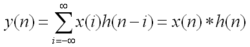
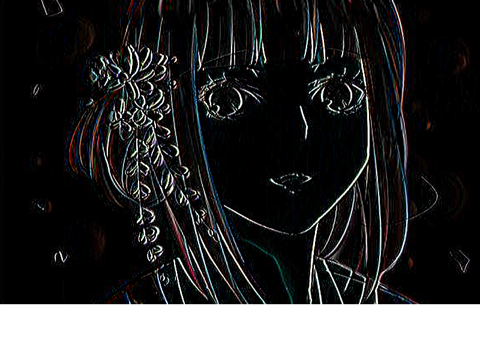

# 图像卷积

## 什么是卷积
最近断断续续在接触卷积神经网络，记得在第一次接触这个概念的时候，第一个问题就是什么是卷积。今天结合`webgl`的例子来聊聊什么是卷积。百科上对卷积的解释是这样的：
> 卷积是两个变量在某范围内相乘后求和的结果。如果卷积的变量是序列x(n)和h(n)，则卷积的结果为：

这个公式表示的是离散型的卷积运算。而连续型的卷积运算需要用到积分，在这里不做阐述。

看这个公式简直迷糊，那么用一个实际的例子来看看卷积是如何计算的。一般来说，一张图片是由许多个排列整齐的像素组成，而像素是由`RGB`(红，绿，蓝)三个通道组成。我们先看一个通道上，卷积是如何计算的。假设图片的信息用如下矩阵表示
```
[
  2, 4, 5, 6,
  1, 3, 1, 3,
  3, 4, 1, 4,
  1, 3, 1, 3
]
```
我们构造一个3*3的卷积(也可以叫做过滤器)
```
[
  1, 0, -1,
  1, 0, -1,
  1, 0, -1
]
```
而卷积的运算就是拿着过滤器从图片的左上角信息上滚过去，直到右下角。比如图片的左上角信息与卷积进行运算
```
[                 [
  2, 4, 5,          1, 0, -1,
  1, 3, 1,     *    1, 0, -1,
  3, 4, 1           1, 0, -1,
]                 ]
```
计算方式就是求和相加：
```
2 * 1 + 4 * 0 + 5 * -1 + 1 * 1 + 1 * 0 + 1 * -1 + 3 * 1 + 4 * 0 + 1 * -1
```
就这样一直滑动过滤器直到计算完图片上所有的值。在上面的例子中，当对图片完成卷积运算后便会得到一个`2 * 2`的矩阵。很显然，计算后的信息变小了。如果你不想然信息变小，可以一开始给图片周围补`0`,使得计算后的信息依然是`3 * 3`。

## 神奇的卷积
那么卷积到底有什么用呢？在图像识别中，卷积的一大用途就是做`Edge detection`, 通过卷积来识别出图片的轮廓特征。而在图片处理中，可以用卷积计算来做出各种滤镜效果。比如这是一张原始图片。

我们使用一个浮雕的卷积序列：
```
[
  -2, -1, 0,
  -1, 1, 1,
  0, 1, 2
]
```
图片就会产生浮雕效果


如果使用一个边缘检测的卷积序列：
```
[
  1, 0, -1,
  2, 0, -2,
  1, 0, -1
],
```
上述是一个检测垂直边缘的序列，那么图片就会把边缘信息个展示出来


是不是炒鸡神奇？

## WEBGL 实现
那么如何实现上述效果呢？我们只需要在`webgl`里载入这个图片作为纹理信息，然后在着色器里进行卷积操作就好了。浏览器里的`webgl`本质上是一个光栅化引擎，需要你传入图像的顶点信息和像素信息。所有我们要做的仅仅是把图片的顶点信息和像素信息传入`webgl`就可以了，然后它就可以绘制出美美的图片。而顶点信息会在顶点着色器里处理，在这里你可以对顶点信息进行修改。像素信息在片段着色器里进行处理，这里你也可以对像素进行修改。而我们要做的图片处理主要是对像素信息进行修改，所以我们在片段着色器里对图像进行进行卷积操作。
```
void main() {
  vec2 onePixel = vec2(1.0, 1.0) / u_textureSize;
  vec4 colorSum =
     texture2D(u_image, v_texCoord + onePixel * vec2(-1, -1)) * u_kernel[0] +
     texture2D(u_image, v_texCoord + onePixel * vec2( 0, -1)) * u_kernel[1] +
     texture2D(u_image, v_texCoord + onePixel * vec2( 1, -1)) * u_kernel[2] +
     texture2D(u_image, v_texCoord + onePixel * vec2(-1,  0)) * u_kernel[3] +
     texture2D(u_image, v_texCoord + onePixel * vec2( 0,  0)) * u_kernel[4] +
     texture2D(u_image, v_texCoord + onePixel * vec2( 1,  0)) * u_kernel[5] +
     texture2D(u_image, v_texCoord + onePixel * vec2(-1,  1)) * u_kernel[6] +
     texture2D(u_image, v_texCoord + onePixel * vec2( 0,  1)) * u_kernel[7] +
     texture2D(u_image, v_texCoord + onePixel * vec2( 1,  1)) * u_kernel[8] ;
  gl_FragColor = vec4((colorSum / u_kernelWeight).rgb, 1.0);
}
```
在 `webgl`里，只需要把一个像素点周围的八个像素点取出来，分别与卷积矩阵相应位上的值进行相乘便可以了。全部代码可以看[这里](https://github.com/MicleMing/ICG-WebGL2/tree/master/src/chapter01/image-processor)
