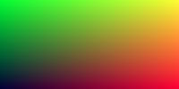

# Ray Tracing I

最近看到一篇文章[Ray Tracing in One Weekend](https://raytracing.github.io/books/RayTracingInOneWeekend.html)（当然还有next week 和 the rest of your life 笑~）， 讲述了一张图片的渲染及呈现过程，觉得甚是有趣，由于文章里是用C++来实现的，便用typescript重新实现了一遍。我会有尽量通俗的语言来翻译和讲述[Ray Tracing in One Weekend](https://raytracing.github.io/books/RayTracingInOneWeekend.html)里的一些知识点和代码实现过程，但依然希望读者有高中水准的数学和物理素养，并且对编程语言有一定了解。依照原文的脉络加上笔者本人的理解，我会整理成一系列的文章。

第一篇文章我会把它分为以下几个部分，当你阅读完这几个部分后，应当可以理解Ray tracing 里光线成像的基本建模。
  - 图片生成
  - 向量工具类
  - 球的绘制

## 图片生成
计算机里任何一种颜色，都可定义成一个固定的数字或变量，而`RGB`是其中一种编码方式，每一个像素可以用三个变量来表示——R(红色）G(绿色）以及B(蓝色）的强度。所以如果我们向一个文件里写入一组由RGB组成的数值，那么计算机便可以识别出这组数值所代表的颜色。比如一个简单的`PPM`格式的图片文件:


`ppm`格式的文件分为两部分，一部分为图片的基本属性的定义，另一部分就是一组RGB值。那么我们就来定义一张宽200px， 高100px的图片。
```ts
function main() {
  const nx = 200;
  const ny = 100;
  // 定义图片属性
  stream.write("P3\n");
  stream.write(`${nx} ${ny}\n`);
  stream.write('255\n');
  // 定义rgb
  for (let j = ny - 1; j >= 0; j--) {
    for (let i = 0; i < nx; i++) {
      const col: vec3 = Vec3.create(i / nx, j / ny, 0.2);
      const r = i / nx;
      const g = j / ny;
      const b = 0.2;
      const ir = Math.floor(255.99 * r);
      const ig = Math.floor(255.99 * g);
      const ib = Math.floor(255.99 * b);
      stream.write(`${ir} ${ig} ${ib}\n`);
    }
  }
}
```
在这段代码里：
- 像素值按照从左到右，从上到下的顺序被写进文件
- 红色与绿色按照图片的宽带和高度渐变，而绿色则保持不变。

把数据写入文件以后，打开文件，便会出现下面的图片：



一张ppm格式图片来说，它的主体便是rgb的数值，你改变它的数值，便呈现出不同的颜色。

## 向量工具类
在大多数图形编程里，都会使用一些数据结构来存储几何向量和颜色（在GPU里，矩阵的运算可以并行进行），比如RGB色值，定点位置，方向等，所以我们设计一个`vec3`的类来对这些数据进行存储和计算。对于`vec3`，我们需要
  - 定义类型
  - 定义运算

其中最为重要的便是定义`vec3`的运算。

对于类型定义，so easy emmmm
```ts
export type vec3 = [number, number, number];
```
然后是定义vec3的运算，由于typescript没法对操作符进行重载，只能老老实实的把每一个运算定义为一个方法。我们可能需要定义向量加法，向量的减法，乘法(dot)，除法和叉乘(cross)， 以及求向量的长度和单位向量和一些辅助函数。具体实现可以看我github上的[代码](https://github.com/MicleMing/ICG-WebGL2/blob/master/src/chapter03/ray-tracker/vec3.ts)
```ts
export class Vec3 {
  static x = (v: vec3) => v[0];
  static y = (v: vec3) => v[1];
  static z = (v: vec3) => v[2];
  static r = (v: vec3) => v[0];
  static g = (v: vec3) => v[1];
  static b = (v: vec3) => v[2];

  static create(v0?: number, v1?: number, v2?: number): vec3;
  static multiply(a: vec3, t: number): vec3;
  static multiply(a: vec3, b: vec3): vec3;
  static add(a: vec3, b: vec3): vec3;
  static substract(a: vec3, b: vec3);
  static devide(a: vec3, t: number): vec3;
  static devide(a: vec3, b: vec3): vec3;
  static dot(a: vec3, b: vec3): number;
  static len(v: vec3): number;
  static unit_vector(v: vec3): vec3;
  static squard_length(v: vec3): number;
  static square(v: vec3): vec3;
  static cross(v1: vec3, v2: vec3): vec3;
}

```

顺便提一下，`cross`运算便是求两个向量的法向量 emmm

有了`vec3`后，便可以对第一部分的代码进行重构
```ts
  for (let j = ny - 1; j >= 0; j--) {
    for (let i = 0; i < nx; i++) {
      const col: vec3 = Vec3.create(i / nx, j / ny, 0.2);
      const ir = Math.floor(255.99 * col[0]);
      const ig = Math.floor(255.99 * col[1]);
      const ib = Math.floor(255.99 * col[2]);
      stream.write(`${ir} ${ig} ${ib}\n`);
    }
  }
```
这样便将颜色用向量进行运算。在这里看起来用`vec3`进行重构显得多此一举，但是后面就知道它的好处了，要知道的是在图形编程里，会用到大量的矩阵运算，所以一开始用向量的数据结构是很有必要的。

## 球的绘制
想象一下，光线照在一个球体上时会发生什么？嗯，光线击中球的位置，然后呈现出球的颜色。所以在绘制球之前，我们还需要做两件事
  - 对光线的轨迹进行描述
  - 计算光线在轨迹上某个点的颜色

在现实世界中，光线从一个光源射出，沿着一条直线进行传播，所以对于光线的运动轨迹，我们可以用一个数学表达式描述:
> 𝑝(𝑡)=𝐴+𝑡∗𝐵

其中，`A`代表的是光源的位置，类型为`vec3`； `B`代表光的传播方向，类型为`vec3`，`t`是一个系数，是一个简单的数值类型. 对于这个模型，我们可以用一个`class`来表示:

```ts
class Ray {
  A: vec3;
  B: vec3;
  constructor(a: vec3, b: vec3) {
    this.A = a;
    this.B = b;
  }
  origin(): vec3 {
    return this.A;
  }
  direction(): vec3 {
    return this.B;
  }
  point_at_parameter(t: number) {
    // p(t) = A + t * B
    return Vec3.add(this.A, Vec3.multiply(this.B, t));
  }
}
```
有了光线的轨迹模型后，就可以去计算在轨迹上光的颜色了（在这里我们先以线性渐变做例子）。为此需要建立一个坐标系。
。

对此我们先做几个假设：
  - 光源的位置是vec3(0, 0, 0)
  - 光会打在前方（z 轴的负方向 )的一块区域
  - 光线一开始的颜色是白色vec3(1 ,1, 1), 逐渐向蓝色vec3(0.5, 0.7, 1.0)过渡

对于线性渐变来说，它是符合渐变函数的:
> 𝑏𝑙𝑒𝑛𝑑𝑒𝑑𝑉𝑎𝑙𝑢𝑒=(1−𝑡)∗𝑠𝑡𝑎𝑟𝑡𝑉𝑎𝑙𝑢𝑒+𝑡∗𝑒𝑛𝑑𝑉𝑎𝑙𝑢𝑒,

所以我们便可以利用这个函数对光线的颜色进行建模, 为此可以用一个`function`来表示:
```ts
function color(ray: Ray): vec3 {
  // unit vector(a) = A / |A|
  const unit_direction: vec3 = Vec3.unit_vector(ray.direction());
  const t = 0.5 * (Vec3.y(unit_direction) + 1);
  // 𝑏𝑙𝑒𝑛𝑑𝑒𝑑𝑉𝑎𝑙𝑢𝑒=(1−𝑡)∗𝑠𝑡𝑎𝑟𝑡𝑉𝑎𝑙𝑢𝑒+𝑡∗𝑒𝑛𝑑𝑉𝑎𝑙𝑢𝑒,
  // when t = 1.0 => blue, when t = 0 => white
  return Vec3.add(
    Vec3.multiply([1.0, 1.0, 1.0], 1.0 - t),
    Vec3.multiply([0.5, 0.7, 1.0], t)
  );
}
```
有了光线轨迹，有了提取光线颜色的函数，自然而然，便可以模拟光线照射时最简单的情况，我们把这两个函数带入我们之前生成图片的那个`main`函数:
```ts
  const lower_left_corner = Vec3.create(-2.0, -1.0, -1.0);
  const horizontal = Vec3.create(4.0, 0.0, 0.0);
  const vertical = Vec3.create(0.0, 2.0, 0.0);
  const origin = Vec3.create(0.0, 0.0, 0.0);

  for (let j = ny - 1; j >= 0; j--) {
    for (let i = 0; i < nx; i++) {
      const u = i / nx;
      const v = j / ny;
      const r = new Ray(
        origin,
        // direction: lower_left_corner + u*horizontal + v*vertical
        Vec3.add(
          Vec3.add(lower_left_corner, Vec3.multiply(horizontal, u)),
          Vec3.multiply(vertical, v)
        )
      );
      const col: vec3 = color(r);
      const ir = Math.floor(255.99 * col[0]);
      const ig = Math.floor(255.99 * col[1]);
      const ib = Math.floor(255.99 * col[2]);
      stream.write(`${ir} ${ig} ${ib}\n`);
    }
  }
```
这样便有了一个由蓝色到白色的渐变图片。


前置条件有了，便可以开始愉快的画一个光线撞击在圆上的效果，回顾一下高中时学的圆的知识：）， 如何用数学的方式来表示一个圆？哦，有一个圆的方程。 圆由圆心和半径构成，有了圆心坐标和半径，便可以确定一个圆， 假设圆心坐标(Cx, Cy, Cz), 半径为R，那么圆的轨迹方程为：
> (𝑥−𝐶𝑥)2+(𝑦−𝐶𝑦)^2+(𝑧−𝐶𝑧)^2=𝑅^2 其中 P = (x, y, z)

我们知道P为圆上任意一点， 在图形编程里，通常需要转换成向量的形式
> 𝑃=(𝑥,𝑦,𝑧)  = (𝑝−𝐶)

因此，对于圆的方程，可以表示为：
> 𝑑𝑜𝑡((𝑝−𝐶),(𝑝−𝐶))=(𝑥−𝐶𝑥)^2+(𝑦−𝐶𝑦)^2+(𝑧−𝐶𝑧)^2 = R^2

有了这个圆的方程，那么怎么与我们的光线结合在一起呢？还记得之前光线的轨迹方程么？
> p(t) = A + t * B

如果光线打在了圆上，那么说明 p(t) = P， 带入圆的方程，得出：
> 𝑑𝑜𝑡((𝑝(𝑡)−𝐶),(𝑝(𝑡)−𝐶))=𝑅^2

展开之后为：
> 𝑑𝑜𝑡((𝐴+𝑡∗𝐵−𝐶),(𝐴+𝑡∗𝐵−𝐶))=𝑅^2

继续展开为关于`t`的一般方程：
> 𝑡^2⋅𝑑𝑜𝑡(𝐵,𝐵)+2𝑡⋅𝑑𝑜𝑡(𝐵,𝐴−𝐶)+𝑑𝑜𝑡(𝐴−𝐶,𝐴−𝐶)−𝑅^2=0

如果这个方程有有解，那么就是光线打在了圆上, 还记得怎么判定一个一元二次方程有解么？哈哈哈， b^2 - 4ac >= 0

所以我们可以把上述过程用代码表示:
```ts
function hit_sphere(center: vec3, radius: number, r: Ray) {
  // 𝑡2⋅𝑑𝑜𝑡(𝐵,𝐵)+2𝑡⋅𝑑𝑜𝑡(𝐵,𝐴−𝐶)+𝑑𝑜𝑡(𝐴−𝐶,𝐴−𝐶)−𝑅2=0
  const oc: vec3 = Vec3.substract(r.origin(), center);
  const a = Vec3.dot(r.direction(), r.direction());
  const b = 2 * Vec3.dot(oc, r.direction());
  const c = Vec3.dot(oc, oc) - radius * radius;
  const discriminant = b * b - 4 * a * c;
  return discriminant > 0;
}
```

修改之前获取光线颜色的函数:
```ts
function color(ray: Ray): vec3 {
  if (hit_sphere(Vec3.create(0, 0, -1), 0.5, ray)) {
    return Vec3.create(1, 0, 0);
  }
  const unit_direction: vec3 = Vec3.unit_vector(ray.direction());
  const t = 0.5 * (Vec3.y(unit_direction) + 1);

  return Vec3.add(
    Vec3.multiply([1.0, 1.0, 1.0], 1.0 - t),
    Vec3.multiply([0.5, 0.7, 1.0], t)
  );
}
```
这样，当光线在圆形区域时，直接变成红色vec3(1, 0, 0);


由此第一部分就完成了，包括了图片生成，光线建模，颜色取值等。之后便可以在此基础上添加一些光线的效果。


