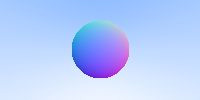
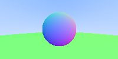

# Ray Tracing II

接上一篇 `Ray Tracker I`， 这一篇我会继续翻译以下几个部分：
- 球的绘制
- 抗锯齿

## 球的绘制

### 法线

在上一篇的文章中，我们讲述了如何生成一个圆，那如何给这个圆添加阴影呢？这就涉及到了`法线`。什么是法线？百科上对它的解释是：
> 法线，是指始终垂直于某平面的虚线。在数学几何中法线指平面上垂直于曲线在某点的切线的一条线。

在我们的例子中，球的法线是光线撞击到球面的位置减去球心的位置


比如在上面的图中，法线为 `N = P - C`。 接着我们就试着把法线可视化出来。用伪代码表示就是：
```ts
N= Ray.point_at_parameter(t) - vec3(0,0,-1)
```
所以我们需要知道光线撞击到球体时的`t`的值。

我们在上一篇已经知道了关于球的方程与光线的方程，并联立得出了一般方程：
> 𝑡^2⋅𝑑𝑜𝑡(𝐵,𝐵)+2𝑡⋅𝑑𝑜𝑡(𝐵,𝐴−𝐶)+𝑑𝑜𝑡(𝐴−𝐶,𝐴−𝐶)−𝑅^2=0

那么在这里，我们就可以利用求根的公式求出`t`的值。修改`hit_sphere`的代码为:
```ts
function hit_sphere(center: vec3, radius: number, r: Ray) {
  // 𝑡2⋅𝑑𝑜𝑡(𝐵,𝐵)+2𝑡⋅𝑑𝑜𝑡(𝐵,𝐴−𝐶)+𝑑𝑜𝑡(𝐴−𝐶,𝐴−𝐶)−𝑅2=0
  const oc: vec3 = Vec3.substract(r.origin(), center);
  const a = Vec3.dot(r.direction(), r.direction());
  const b = 2 * Vec3.dot(oc, r.direction());
  const c = Vec3.dot(oc, oc) - radius * radius;
  const discriminant = b * b - 4 * a * c;
  if (discriminant < 0) {
    return -1;
  }
  return (-b - Math.sqrt(discriminant)) / (2 * a);
}
```
在这段代码里，如果光线撞击到了球，那么就把其中的一个解返回，否则就返回`-1`。拿到`t`的值之后，带入`N = P - C`后，我们便可以求出法线了。

### 法线的可视化
有了法线之后，便可以试着将它可视化出来。为了方便计算，我们把法线的长度变为一个单位，所以取值是[-1, 1], 为了映射到`RGB`的值，我们再把法线映射到[0, 1]的区间。这时候法线`(x, y, z)`便可以映射为`(r, g, b)`, 修改我们之前的`color` 的代码:
```ts
function color(ray: Ray): vec3 {
  let t = hit_sphere(Vec3.create(0, 0, -1), 0.5, ray);
  // hited
  if (t > 0) {
    // N = P - C
    const N: vec3 = Vec3.unit_vector(
      Vec3.substract(ray.point_at_parameter(t), Vec3.create(0, 0, -1))
    );
    // Map (-1, 1) => (0, 1)
    return Vec3.multiply(
      Vec3.create(Vec3.x(N) + 1, Vec3.y(N) + 1, Vec3.z(N) + 1),
      0.5
    );
  }
  // unit vector(a) = A / |A|
  const unit_direction: vec3 = Vec3.unit_vector(ray.direction());
  t = 0.5 * (Vec3.y(unit_direction) + 1);
  // 𝑏𝑙𝑒𝑛𝑑𝑒𝑑𝑉𝑎𝑙𝑢𝑒=(1−𝑡)∗𝑠𝑡𝑎𝑟𝑡𝑉𝑎𝑙𝑢𝑒+𝑡∗𝑒𝑛𝑑𝑉𝑎𝑙𝑢𝑒,
  // when t = 1.0 => blue, when t = 0 => white
  return Vec3.add(
    Vec3.multiply([1.0, 1.0, 1.0], 1.0 - t),
    Vec3.multiply([0.5, 0.7, 1.0], t)
  );
}
```
如此，便把法线进行了可视化, 法线描述了光线的撞击点与球心的关系，之后便可以利用这个关系作出多种可视化效果。暂时先只是简单的做一个映射。



### 绘制多个圆

到目前为止，我们只是画了一个球体，那如果要画出多个球体该如何做呢？我们很当然的想到，如果我们有一个`sphere`的类，需要的时候`new`一个实例便可以了。那这个`sphere`都是会被光线捕获的，只有光线照射在球上时，球才能被看到，所以它会有一个`hit`来对光线进行处理。在这里，我们创建一个`abstract class` 来让`sphere`继承。
```ts
export type hit_record = {
  t: number;
  p: vec3;
  normal: vec3;
};

export abstract class hittable {
  hit: (
    r: Ray,
    t_min: number,
    t_max: number,
    hit_record: hit_record
  ) => boolean;
}
```
这里需要定义个`hit_record`的记录项，一但光线撞击到了球体，我们需要记录下当前这束光线的`t`值，撞击位置`p`， 已经对于的法线`normal`。大多数的光线追踪的代码里，都会对`t`进行校验，只有  `t_min < t < t_max` 时会对光线进行判断。

然后我们去实现这个`hit`方法。 就是把之前的`hit_sphere`方法放到`hit`里面
```ts
export class Sphere implements hittable {
  center: vec3;
  radius: number;
  constructor(props: Props) {
    this.center = props.center;
    this.radius = props.radius;
  }
  hit(r: Ray, t_min: number, t_max: number, rec: hit_record) {
    const { center, radius } = this;
    // 𝑡2⋅𝑑𝑜𝑡(𝐵,𝐵)+2𝑡⋅𝑑𝑜𝑡(𝐵,𝐴−𝐶)+𝑑𝑜𝑡(𝐴−𝐶,𝐴−𝐶)−𝑅2=0
    const oc: vec3 = Vec3.substract(r.origin(), center);
    const a = Vec3.dot(r.direction(), r.direction());
    const b = 2 * Vec3.dot(oc, r.direction());
    const c = Vec3.dot(oc, oc) - radius * radius;
    const discriminant = b * b - 4 * a * c;
    if (discriminant > 0) {
      let temp = (-b - Math.sqrt(discriminant)) / (2 * a);
      if (temp < t_max && temp > t_min) {
        rec.t = temp;
        rec.p = r.point_at_parameter(rec.t);
        rec.normal = Vec3.unit_vector(Vec3.substract(rec.p, center));
        return true;
      }
      temp = (-b + Math.sqrt(discriminant)) / (2 * a);
      if (temp < t_max && temp > t_min) {
        rec.t = temp;
        rec.p = r.point_at_parameter(rec.t);
        rec.normal = Vec3.unit_vector(Vec3.substract(rec.p, center));
        return true;
      }
    }
    return false;
  }
}
```

为了方便，我们用一个`Hittable_list`来把所有的`sphere`管理起来, 当成一个`scence`。
```ts
export class Hittable_list implements hittable {
  list: hittable[];
  list_size: number;
  constructor(props: Props) {
    this.list = props.l;
    this.list_size = props.n;
  }

  hit(r: Ray, t_min: number, t_max: number, rec: hit_record) {
    let temp_rec: hit_record = {
      t: 0,
      p: Vec3.create(),
      normal: Vec3.create()
    };
    let hit_anything = false;
    let closest_so_far = t_max;
    for (let i = 0; i < this.list_size; i++) {
      if (this.list[i].hit(r, t_min, closest_so_far, temp_rec)) {
        hit_anything = true;
        closest_so_far = temp_rec.t;
        rec.normal = temp_rec.normal;
        rec.p = temp_rec.p;
        rec.t = temp_rec.t;
      }
    }
    return hit_anything;
  }
}
```

这样之后，便可以在需要的时候，为一个`scence`创建多个球体
```ts
  const list: hittable[] = [
    new Sphere({ center: Vec3.create(0, 0, -1), radius: 0.5 }),
    new Sphere({ center: Vec3.create(0, -100.5, -1), radius: 100 })
  ];

  const world: hittable = new Hittable_list({ l: list, n: 2 });
```
效果可以看下面的图片：



如此我们便在一个场景里绘制了多个球。可以看到球体的表面已经有了颜色，这便是法线的值被映射成RGB所产生的颜色。

## 抗锯齿
如果放大上面的图片，我们会发现球的边缘是有明显的锯齿的。但是在我们用照相机来拍摄一张照片的时候，在图像的边缘通常看起来是平滑的，这是因为锯齿被混在背景或者前景里了。我们可以用一个简单的方法来模拟这种效果：在求一个像素的rgb值的时候，可以取该像素附近的100个像素作为样本，然后求这100个样本的平局值作为该像素的值，所以改造之前`main`函数里的代码：
```ts
  // const nx = 200;
  // const ny = 100;
  // const ns = 100;
  for (let j = ny - 1; j >= 0; j--) {
    for (let i = 0; i < nx; i++) {
      let col = Vec3.create();
      for (let s = 0; s < ns; s++) {
        const u = (i + Math.random()) / nx;
        const v = (j + Math.random()) / ny;
        const r = cam.get_ray(u, v); // Camera instance
        col = Vec3.add(col, color(r, world));
      }
      col = Vec3.devide(col, ns);

      const ir = Math.floor(255.99 * col[0]);
      const ig = Math.floor(255.99 * col[1]);
      const ib = Math.floor(255.99 * col[2]);
      stream.write(`${ir} ${ig} ${ib}\n`);
    }
  }
```
在这里，我们也把定义了一个`Camera`的类，通过这个类来获取光线
```ts
export class Camera {
  lower_left_corner: vec3;
  horizontal: vec3;
  vertical: vec3;
  origin: vec3;

  constructor(l: vec3, h: vec3, v: vec3, o: vec3) {
    this.lower_left_corner = l;
    this.horizontal = h;
    this.vertical = v;
    this.origin = o;
  }

  get_ray(u: number, v: number): Ray {
    const { origin, lower_left_corner, horizontal, vertical } = this;
    // lower_left_corner + u*horizontal + v*vertical - origin
    const direction = Vec3.substract(
      Vec3.add(
        Vec3.add(lower_left_corner, Vec3.multiply(horizontal, u)),
        Vec3.multiply(vertical, v)
      ),
      origin
    );
    return new Ray(origin, direction);
  }
}
```
通过取均值的办法来使得边缘更好的融入周围的颜色当中，在视觉上便起到了平滑过渡的效果。

在这篇文章中，我们介绍了如何绘制多个对象，并且利用求均值法来进行锯齿的修复。


