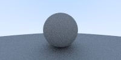

# Ray Tracing III

接着之前的两篇`Ray Tracing I` 和 `Ray Tracing II`, 在接下来的文章里，我会开始介绍材质对光照的影响。

在初中学习光线的的时候，有提到光线的一些性质：在粗糙物体的表面，光线会发生漫反射；在光滑的物体表面，光线会发生折射；在电介质(比如水)里，会发生折射。光的这些性质会共同作用形成了我们眼里的大千世界。那么今天我们便开始探讨的如何在计算机里模拟出这光的魔法。这篇文章会讨论如何模拟光线在粗糙材质下的效果。

## 粗糙材质
粗糙材质会发生漫反射，而光线发生漫反射时有两个光学特性：
- 光线发生反射的方向是近似于随机(其实和表面细小的切面有关，就当时随机吧)
- 部分光线会被吸收

### 随机反射
粗糙材质不会主动发生光线，它的光线来源便是它周围的环境。当环境里的光束撞击到它的表面的时候，光线会按照随机的方向进行反射。


那么如何模拟它随机反射的方向呢？我们采用一个简单的方法： 我们选择一个单位圆，这个单位圆与光线与材质的撞击点 `P` 相切，然后在这个单位圆里随机找一点 `S` , 那么这个点 `S` 与点 `P` 的连线方向便是反射的方向。


这时单位圆的圆心为 `p + N`。(N 为法线，法线计算参看 `Ray Tracing II`)。我们可以用下面的代码来计算上述的点`P`
```ts
function random_in_unit_sphere(): vec3 {
  let s: vec3;
  do {
    // s = 2 * (x, y, z) - vec3(1, 1, 1);
    s = Vec3.substract(
      Vec3.multiply(
        Vec3.create(Math.random(), Math.random(), Math.random()),
        2
      ),
      Vec3.create(1, 1, 1)
    );
  } while (Vec3.squard_length(s) >= 1);
  return s;
}
```

### 光线吸收
在上面一节里，我们找到了 `P` 点来作为随机反射的方向，那么便有了第二个问题：如何模拟吸收的光线？在粗糙的物体上，光线并不会被全部反射回来，有一部分会被材质吸收掉，不同的材质对光线的吸收效果不一样，暂且为了简单起见，在这里我们先以 `0.5` 的系数进行吸收，也就是会吸收一半的反射光线。所以只需要在计算关系的颜色时，对结果乘以​0.5就好了。

### 合在一起

解决了随机反射和光线吸收的问题， 那么如何将材质和几何图形集合在一起呢？其实很简单，当一个几何图形符合某些的光学特性的时候，那么在计算机里可以理解为这个几何图形是由某些材质构成的。在我们的代码里，我们的几何图形是球体，那么只需要在光线撞击到球体时，计算反射关系就可以了。​把之前的代码稍作改动:
```ts
function color(ray: Ray, world: hittable) {
  ...
  if (world.hit(ray, 0.001, 10000000, rec)) {
    // target = P + N + S
    const target = Vec3.add(
      Vec3.add(rec.p, rec.normal),
      random_in_unit_sphere()
    );
    // direction = target - P
    return Vec3.multiply(
      color(new Ray(rec.p, Vec3.substract(target, rec.p)), world),
      0.5
    );
  }
  ...
}
```
当光线撞击到球体的时候，便对光线的反射方向进行计算。如下便是加了随机反射后的效果。


然而，看到这张图，会不会觉得太暗了？我们的光线在代码里明显才吸收`50%`呀，为什么这么暗？这就引出了一个新的概念 - `Gamma 校正`。

### Gamma 校正
Gamma校正简单的说就是对物理亮度的校正。出现这个问题的原因的一个说法是由于早期CRT显示器的问题，输出的亮度和输入的电压并非线性关系，而是近似2.2次幂的关系，导致进入人眼的亮度要比计算机上存储的亮度要低。在我们的代码里，用一个近似的方法，即对色值进行开方。
```ts
  for (let j = ny - 1; j >= 0; j--) {
    for (let i = 0; i < nx; i++) {
      ...
      // gamma correction
      col = Vec3.square(Vec3.devide(col, ns));
      const ir = Math.floor(255.99 * col[0]);
      const ig = Math.floor(255.99 * col[1]);
      const ib = Math.floor(255.99 * col[2]);
      stream.write(`${ir} ${ig} ${ib}\n`);
    }
  }
```
最后便得到了下面的图片:


## 最后
我们在这篇文章里讲述了如何利用计算机模拟粗糙物体的光学特性，并用`typescript`来实现。如果感兴趣可以看之前的两篇文章。
- [Ray Tracing I](./1.md)
- [Ray Tracing II](./2.md)


