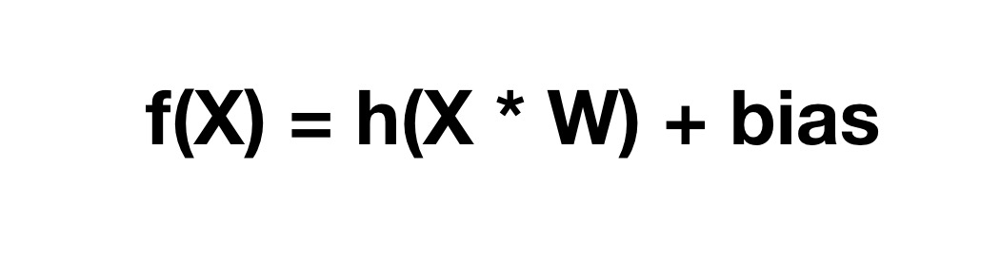

# 让你的程序学会打乒乓球
乒乓球的小游戏估计很多人小时候都玩过，就是球过来的时候移动球拍去接球。正巧近日在学习神经网络，心想如果训练一个程序来打乒乓球岂不是别有一番乐趣。说干就干，于是便花了些撸完了这个程序。界面有些搓就是了

在这个程序里，球拍会自动根据球的位置来进行移动去接球。这个程序里的控制核心就是神经网络和遗传算法。通过神经网络来进行计算，通过遗传算法来进行训练。那什么是神经网络和遗传算法呢？那接下来就来介绍一番。

## 神经元
在介绍神经网络之前，先来说说什么神经元。神经元是处理信息的单元，它由树突，轴突和细胞体组成。树突接受信息，细胞体则进行信息的处理，而轴突将信息传导出去。我们可以用下面的图直观的表示出来

但是毕竟我们之后是要利用程序来模拟神经元，所以我们还需要进一步进行抽象。我们可以用更符合化的模型表述为这个样子

输入`(input)`是外界的输入，它乘以一个权重`(widghts)`得到一个线性的结果，然后在进行一次激活处理`(activation)`，就得到了输出。所以这个模型的输出可以用如下的式子进行表示：

这里表示的是一个输出是如何计算的。这里的`h`函数其实就是一次激活的运算。在这个程序里，它把输入映射到[0,1]的区间。

这个表示激活函数的数学图像，它可以把任何的输入转化到[0,1]的区间。

## 神经网络
知道了什么是神经元后，我们便可以利用神经元组成神经网络。神经网络一般分为三层，输入层(Input Layer), 隐藏层(Hidden Layer)和输出层(Output Layer).

在上面的图里，第一层就是输入层`(Input Layer)`，第二层是隐藏层`(Hidden Layer)`，第三层是输出层`(Output Layer)`。而每一层则有若干个神经元组成。每个神经元接收输入，然后计算，最后输出结果到下一个神经元。其中每条边代表着一个输入路径。

比如上图中红色标记的神经节点的输入就是：`x1 * w1 + x2 * w2  + x3 * w3 + x4 * w4`
对于上图隐藏层来说, 总共有八个神经节点，这八个节点的输入为：

其中`x0`是偏置位，表示加入一个常量，让整个网络更加健壮。 上述的计算我们可以用矩阵的形式来更简洁的表示。

最后再对所有的`z`进行一次激活，然后输出到下一层。这就是神经网络进行计算的方式。计算的代码可以表示为：

我们通过最后一个节点的输出(a3)来表示球拍需要往上移动接球还是往下移动接球。前面说过我们会把输入映射到[0,1]的区间，所以可以认为当`a3 > 0.5`时，往上移动，反之往下移动。只要我们找到了合适的权重`(weights)`，便可以做出正确的预测。所以我们需要去不断的训练来找到合适的权重。

## 遗传算法
有了神经网络后，那该如何去像训练小孩一样去训练它呢？答案就是利用遗传算法。那什么是遗传算法？所谓的遗传算法就是模拟物种优胜劣汰的进化方式来筛选优势物种。借用网络上的一张图片来表示如下：

它分为以下几个步骤
1. 随机产生一批个体(产生多个球拍)
2. 进行生存练习（球拍去接球）
3. 找到最合适的个体（得分高的球拍）
4. 个体进行杂交产生下一代(球拍的神经网络参数各取一部分进行重组)
5. 个体基因突变(新一代的球拍参数有一定概率变化)
6. 重复`2~5`的过程直到找到你满意的个体(球拍)

### 寻找合适个体
在上述过程中，我们需要找到合适的个体，那如果找到合适的个体呢？很简单，得分高的就是合适的。

在游戏中，我们只需要把得分最高的前两名拿出来就好了。这就是所谓的优胜劣汰，嗯，大自然是残酷的。

### 杂交
寻找到合适的个体后，那么我们就是需要让这些个体进行杂交，杂交是互相交换信息。比如下面的例子：

两个信息段分别取出自己一半的信息，组成新的信息片段。从所有都是`0`和`1`变成一半是`0`一半是`1`.而在我们的游戏中，我们需要的是互相交换神经网络中的权重的信息。所以我们可以这样做：

### 突变
为了保证生物的多样性，物种会有一定的概率发生基因突变。下面的图显示了一个基因突变的例子：

两个信息片段分别在第三位和第五位由1变成0，这样就是一个突变的例子。在我们的程序中，表现的就是权重参数有一定概率的改变，代码如下：

重复以上的过程，直到找到你满意的能一直接到球的球拍就好了。

## 在游戏中应用上述算法
那如何在游戏中应用上述的算法呢？首先让我们先给球拍和球进行建模
#### 球
在游戏中，对于乒乓球，是这样设计的

有速度，x坐标和y坐标，以及运动方向，球在游戏中的运动都是取决与这些变量的组合。
#### 球拍
对于球拍，我们可以设计如下接口

有球拍的x坐标和y坐标，以及一些自身元素的属性。球拍在游戏中的运动也是取决于这些变量。当乒乓球与乒乓球拍的在坐标上重合时，我们就可以认为接到球了。而神经网络要做的就是通过移动乒乓球拍使得它们的坐标重合。

#### 组合在一起
我们可以给球拍装一个大脑，这个大脑其实就是神经网络的实例。所以只需要把球拍的信息和球的信息输入预测程序，利用遗传算法不断的进行进化，最终便是可以找到一个参数组合，能预测球的落点，从而接到球。

## 总结
以上便是自制一个土味的塑料AI来玩乒乓球的游戏，一个简单的算法便可以做出很好玩的应用。你可以直接点击这里进行试玩: [pingpong](https://micleming.github.io/AI-pingpong/)。也可以直接看[代码](https://github.com/MicleMing/AI-pingpong)